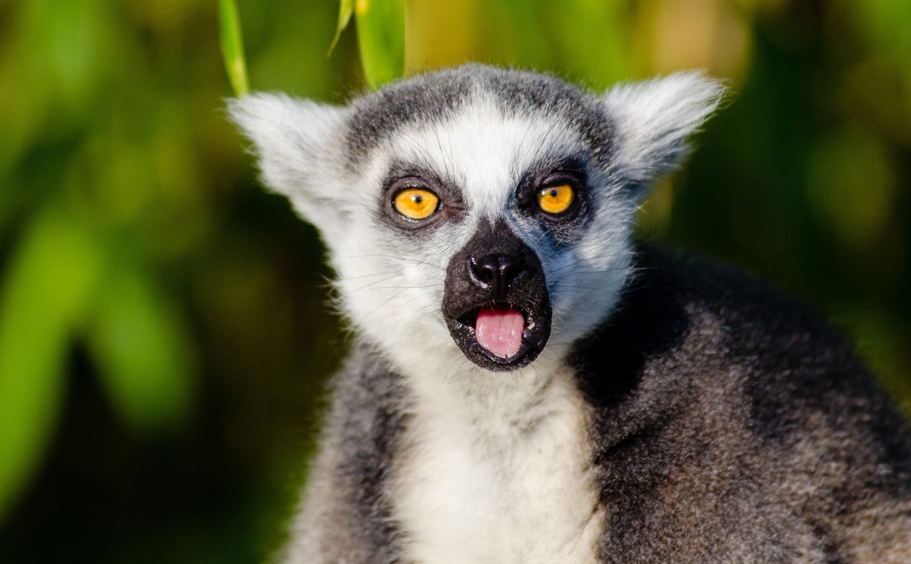

## Course Description

Genetic and genomic data are increasingly used by ecologists and evolutionary biologists in general. It has thus become important for many biologists with different levels of experience to produce and analyse genetic (and genomic) data. In this course we will take a practical approach to the analysis of genetic and genomic data, but we will also provide some of the theoretical background required to understand the outputs of the software used. This course will be organised so as to mix lectures where important notions are introduced with practicals where freely available software will be used. While this will not be the focus of the course, we will also introduce and discuss genealogical (coalescent-based) simulation methods and those based on forward-in-time simulations. Altogether this will allow to discuss the potentialities and limitations of the tools available to the community.

In this five-day course we will introduce the main concepts that underlie many of the models that are frequently used in population genetics. We will focus on the importance of demographic history (e.g. effective sizes and migration patterns) in shaping genetic data. We will go through the basic notions that are central to population genetics, insisting particularly on the statistics used to measure genetic diversity and population differentiation. The course will also cover a short introduction to coalescent theory, Bayesian inference in population genetics and data simulation. We will also introduce methods that have been recently developed to analyse genomic data such as the PSMC method of Li and Durbin that reconstructs the demographic history of a species or population with the genome of a single individual.

Most theory will be put into practice in practical sessions, analyzing real and/or simulated datasets. In these sessions, we will look at measures of genetic diversity and differentiation and use methods to infer demographic history. We will learn how to perform coalescent simulations of genetic/genomic data (using mainly Richard Hudson's ms program). We will also show how to simulate data for PSMC analyses. This will allow users to compare the PSMC obtained with real data to those obtained for the models they used. We will also look at how habitat fragmentation can be simulated using an in-house program. Some exercises will make use of R scripts (R being a freely available statistical program). Basic R knowledge is a pre-requisite but we will provide a short introduction to R. The R statistical package is a very powerful tool to analyse data outputs from many population genetics software, and can also be used to simulate genetic data under simple demographic scenarios.

## Target Audience

This course is intended for those wishing to analise genomic data under models of population genetics.

## Detailed Program

Find the detailed program [here](./pages/detailed_program.md)

## Course Documentation

* Day 1 [Coalescent theory](./pages/Day1_coalescent.md)
* Day 2 [Demographic Inference in Population Genetics 1](./pages/Day2_DemogInf1.md)
* Day 3 [Demographic Inference in Population Genetics 2](./pages/Day3_DemogInf2.md)
* Day 4 [Influence of population structure on the demographic inference](./pages/Day4_PopStructDH.md)
* Day 5 [Demographic history with genomic data](./pages/Day5_DH_genomic_data.md)

---

<!--- ### Learning objectives
-->

### [Instructors](pages/instructors.md)

---

The source for this course webpage is [on github](https://github.com/GTPB/PGDH19).
