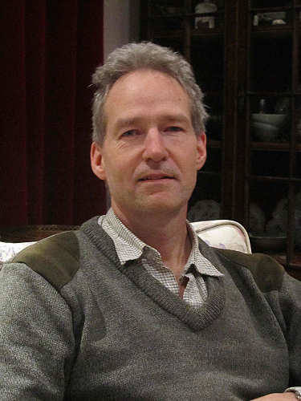
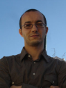
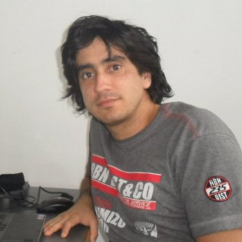
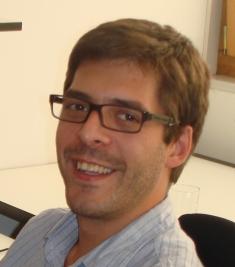
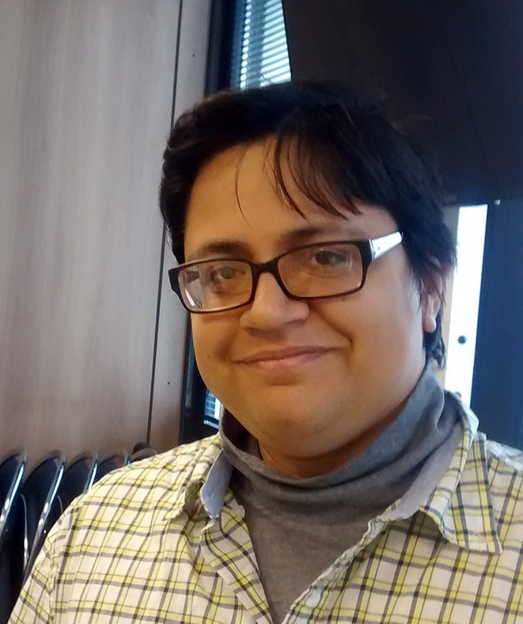

## Instructors

    

**Mark Beaumont** obtained his PhD in population genetics at the University of Nottingham in 1988. His main research focuses on how genetic information can be used to uncover the demographic history of populations, and how to disentangle the effects of demography and selection, often in the context of conservation genetics. Since June 2010 he has held a joint position in Mathematics and Biology at the University of Bristol. Previously he worked at the University of Reading (1999-2010), for the Zoological Society of London (1995-1999), as well as holding a number of earlier postdoctoral positions.

**Affiliations:** Schools of Mathematics and Biology, University of Bristol, Bristol, UK

---

    

**Lounès Chikhi** obtained his PhD in 1995 from the University of Paris working in population genetics of fish, in Montpellier, Sète and Abidjan. He is a CNRS Senior Researcher based in Toulouse, France but has also been working at the IGC since 2005, where he is the PI of the Population and Conservation Genetics group. He held post-doctoral positions at the Universities of Padua and Ferrara, at the Institute of Zoology in London, at Queen Mary and Westfield College and at University College London, and Cardiff University. He is interested in the use of genetic data to improve our understanding of the past demographic history of different species, including our own. His main interests span from conservation genetics of wild and domesticated species to human recent evolutionary history. He has been increasingly interested in population and social structure and how they, together with sampling, influence demographic inference. 

**Affiliations:** Laboratoire Evolution et Diversité Biologique, CNRS, Toulouse, FR
Instituto Gulbenkian de Ciência, Oeiras, PT

---

    

**Willy Rodriguez** obtained his PhD in 2016 at the Institut de Mathématiques de Toulouse (IMT), in France, under the co-supervision of Olivier Mazet (IMT) and Lounès Chikhi (CNRS/IGC). He is a Mathematician by background and worked on the development of statistical methods to use of genomic data to reconstruct the history of species. He is interested in the development of computational and analytical methods to understand the relative roles of changes in population size and changes in connectivity in the patterns observed in present-day populations. After a post-doctoral project at INRA in Orsay University in France and a one-year post-doctoral fellow at the IMT, he is now a post-doctoral researcher at the Instituto Gulbenkian de Ciência. 

**Affiliation:** Instituto Gulbenkian de Ciência, Oeiras, PT

---

    

**Vitor Sousa** obtained his PhD in 2010 from the Universidade de Lisboa, after developing is thesis work at the IGC in Oeiras, PT under the co-supervision of Lounès Chikhi (IGC) and Manuela Coelho (FCUL). He was a postdoctoral researcher in Jody Hey's lab (Rutgers University, New Jersey, USA) from 2010 to 2013, and in Laurent Excoffier's lab (University of Bern and Swiss Institute of Bioinformatics, Switzerland) from 2013 to 2016. He is currently an invited Researcher at the cE3c in order to address biological questions arising in the fields of speciation, conservation, molecular ecology and human genetics from a population genomics perspective. His research aims at understanding the roles of demography and selection in the structure and divergence of populations. In particular, he is interested in developing inference methods to extract such information from population genomics data, and hence his work involves population genetics theory, modeling, statistics and data analysis. For this purpose he has developed approximate Bayesian computation (ABC) methods to study population admixture, full likelihood methods to study population divergence and detect the effects of natural selection, and composite likelihood methods to infer the demographic history of populations. 

**Affiliation:** cE3c - Centre for Ecology, Evolution and Environmental Changes, Faculdade de Ciências, Universidade de Lisboa, Lisboa, PT

---

    

**Armando Arredondo** is a PhD student at the *Institut National des Sciences Appliquées* (INSA Toulouse), in France, under the co-supervision of Olivier Mazet (IMT) and Lounès Chikhi (CNRS/IGC). He is a Mathematician by background and is currently working on new statistical methods allowing the use of genomic data to reconstruct the history of species under models of populations structure. He is interested in stochastic processes, and in the interface between mathematics and biology, including computational methods to understand how changes in population size and connectivity influence genomic patterns observed in present-day populations.  
**Affiliation:** Institut National des Sciences Appliquées (INSA Toulouse), FR

 

### Back

Back to [first page](../index.md).