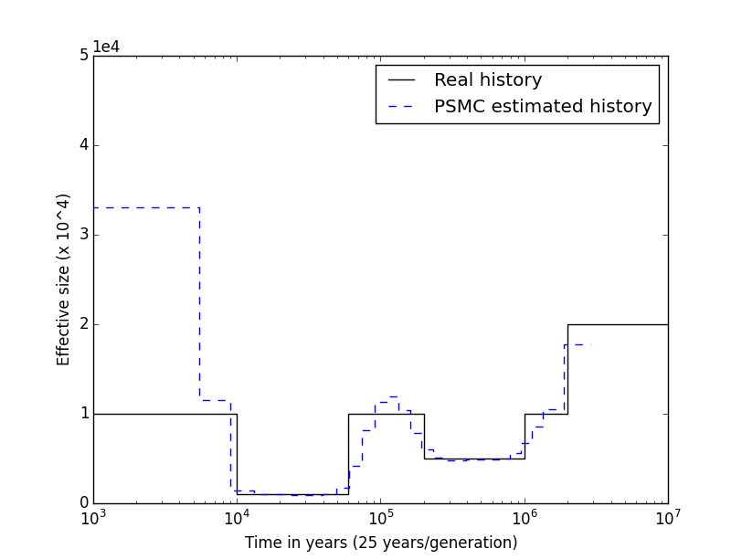

This is a simple tutorial showing how to use PSMC to infer the population size history from full DNA sequences. We will apply the PSMC to simulated data.

We need:

* The [ms](http://home.uchicago.edu/rhudson1/source/mksamples.html) software.
* The [PSMC](https://github.com/lh3/psmc) software.
* Two python [scripts](https://github.com/willyrv/ms-PSMC) (one for converting files and the other one for plotting the results)

Downloading and compiling softwares
-----------------------------------

**Download and compile ms**

- Go to [http://home.uchicago.edu/rhudson1/source/mksamples.html](http://home.uchicago.edu/rhudson1/source/mksamples.html) and download the file ms.tar.gz
- Uncompress the file

```bash
tar -zxvf ./ms.tar
```

- Compile ms

```bash
cd msdir
gcc -O3 -o ms ms.c streec.c rand1.c -lm
```

Have a look to the ms *readme* file for more details. The original paper can be viewed [here](http://bioinformatics.oxfordjournals.org/content/18/2/337.short)

<br/>

**Download and compile psmc**

- Clone the github repository

```bash
  git clone https://github.com/lh3/psmc.git
```

- Compile

```bash
cd psmc
make
cd utils
make
```

The model of the PSMC was published by [Li and Durbin][1] in 2011. For the analysis we will generate a dataset similar to the first dataset used in the Supplementary Materials of the [Li and Durbin paper](http://www.nature.com/articles/nature10231).

<br/>

**Download the python scripts**

```bash
  git clone https://github.com/willyrv/ms-PSMC.git
```

Finaly, create a new folder and copy the binary files *./msdir/ms* and *./psmc/psmc* as long as the python scripts.

<br/>

Simulating data and running the analysis
----------------------------------------

I will suppose you have all this file in a folder:

```bash
|- ms
|- psmc
|- ms2psmcfa.py
|- plot_results.py
```

You need to verify that the files have execution permissions. To give execution permissions to the files type:

```bash
  chmod +x ./*
```

<br/>

**1-) Simulate the data with *ms*. Run:**

```bash
./ms 2 100 -t 30000 -r 6000 30000000 -eN 0.01 0.1 -eN 0.06 1 -eN  0.2 0.5 -eN 1 1 -eN 2 2 -p 8  > sim1.ms
```

Normally this takes less than 30 seconds and should produce one output file (here called “sim1.ms”). Now we will use the *ms2psmcfa.py* python script to convert this ms output into the input file of PSMC.

<br/>

**2-) Run:**

```bash
  ./ms2psmcfa.py ./sim1.ms > sim1.psmcfa
```

This creates the file “sim1.psmcfa” which is the input of PSMC. (This step is also fast, less than 30 seconds). Now we can run the PSMC analysis. For explanations about the parameters, see the [README](https://github.com/lh3/psmc/blob/master/README) file of PSMC.

<br/>

**3-) Run:**

```bash
  ./psmc -N25 -t15 -r5 -p 4+25*2+4+6 -o dem_history_sim1.psmc ./sim1.psmcfa
```

This is a bit long (about 3 hours). At the end, you should get a file like [this](http://wrodrigu.perso.math.cnrs.fr/GTPB/tutorial_psmc/result_files/dem_history_sim1.psmc)

If you don't want to wait, you can download the result file

```bash
  wget http://wrodrigu.perso.math.cnrs.fr/GTPB/tutorial_psmc/result_files/dem_history_sim1.psmc
```
Once the psmc analysis is finished, you can plot the results.

<br/>

**4-) Run:**

```bash
  ./plot_results.py
```

And you will finally get a figure with the inferred demographic history (dashed blue line) and the real history (continuous black line) corresponding to the *ms* command.


You can also plot the psmc results by using the perl script *utils/psmc_plot.pl* wich comes with the PSMC software.

<br/>

> <p>[1]  http://www.nature.com/articles/nature10231 "Heng Li & Richard Durbin, Inference of human population history from individual whole-genome sequences,  Nature 475, 493–496 (28 July 2011) doi:10.1038/nature102312011"</p>

<br/>

### Back

Back to [Day #4](./Day4_PopStructDH.md).  
Back to [first page](../index.md).
