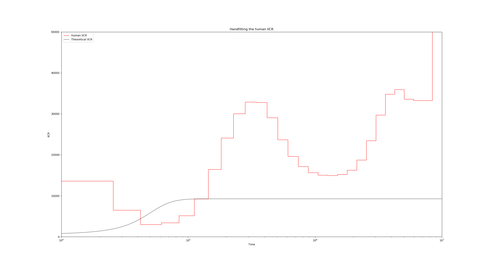

# Hand-fitting a human PSMC with an _n_-island model

In this tutorial we will give an approximate explanation to a human PSMC using a non-stationary symmetrical n-island model by performing curve fitting of the IICR by hand, using the techniques introduced in [Rodríguez et. al. (2018)](https://www.nature.com/articles/s41437-018-0148-0).

## What you'll need:

1. **A working version of Python with the numpy and matplotlib libraries**. You will find these tools installed in your environment, but in general, a good idea is to install [Anaconda](https://www.anaconda.com/download/).

2. **A group of Python scripts** that do things like computing the IICR from $T_2$ values produced with ms, computing the theoretical IICR for several structured scenarios, etc. You can do:
    ```
    git clone https://github.com/willyrv/IICREstimator
    ```
    to clone de repository, or you can download the files in a .zip file from [here](https://github.com/willyrv/IICREstimator).

3. **A working version of ms**. Again, you will find it already installed in your environment. To test this, just type `ms` in your shell prompt. You could also download the source from [here](http://home.uchicago.edu/rhudson1/source/mksamples.html) and follow the instructions to compile it yourself. You can find the documentation of the software [here](https://housecloud.willyrv.com/index.php/s/aFxTPRmdTzsk2RV).


## The configuration file

The description for the scenarios to be simulated or computed are specified in a configuration text file. The path to this file has to be specified when we run the main _estimIICR.py_ script. The configuration file is in JSON format. You can see details about the JSON format [here](https://www.json.org/) or [here](https://tools.ietf.org/html/rfc7159.html).

The configuration  file contains descriptions of various demographic scenarios, in several formats, and instructions on how to plot their corresponding IICRs. For this tutorial we are interested in loading a single PSMC file, of a human genome in this case, to use as visual reference during the hand-fitting process; as well as a theoretical _n_-island, one that we are going to build from the ground-up to have it match the human PSMC.

## Loading a PSMC file and an _n_-island model

Lets take a look at the configuration file _hand_fitting.json_, which has already some of the materials that we are going to need fot this tutorial. To do this, just head to the directory with the python scripts and run:
```bash
python ./estimIICR.py ./hand_fitting.json
```
You should get a figure like this:


The two visible curves are:
* In red, the PSMC curve of a modern human. The instructions for this plot are located in lines 3 to 14 of the JSON file:
  ```
  "use_real_data": [
      {
          "psmc_results_file": "./human/French_upper.psmc",
          "mu": 1.25e-8,
          "binsize": 100,
          "label": "Human IICR",
          "color": "r",
          "linestyle": "-",
          "linewidth": 1,
          "alpha": 1
      }
  ],
  ```
  Here, the key entries are the `"psmc_results_file"` which contains the PSMC filename to plot, and the `"mu"` parameter which is important in order to scale the curve properly.
* In black, we have the theoretical IICR of a stationary _n_-island model. The relevant part of the JSON file here is in lines 16 to 28:
  ```
  "theoretical_IICR_nisland": [
      {
          "n": 10,
          "M": 1,
          "size": 1,
          "sampling_same_island": 1,
          "label": "Theoretical IICR",
          "color": "k",
          "linestyle": "-",
          "linewidth": 1,
          "alpha": 0.5
      }
  ],
  ```
  The parameters `n`, `M` and `size` indicate the number of islands of the model, the global migration rate, and the deme size respectively. Note that since this is a symmetrical model, these three parameters are sufficient for specifying the model.

## Experimenting with the scaling and the structure parameters

Lets take a look at lines 41 and 42 of the JSON configuration file:
```
"scale_params": {
    "N0": 500,
    "generation_time": 25
},
```
The parameters `N0` and `generation_time` are responsible for setting the scaling of all theoretical and empirical (ms simulated) IICR curves of the entire scenario, since for these curves, the coalescent time unit is scaled in $2N_0$ generations, and the IICR values themselves are in units of $N_0$.

The PSMC curves on the other hand are not affected by the `N0` parameter since their scaling is obtained according to the mutation rate (`mu` in line 6), however they are initially scaled in units of generations in the time axis, so the `generation_time` parameter does affect the PSMC plots.

To see this in action, lets change the `N0` and observe the relative change between the theoretical IICR and the human PSMC. Go to line 41 and set `N0` to 1000 instead of 500. After running the script again, you get the following figure:


Notice how the black IICR curve has slightly shifted upwards and to the right, and now its initial rising hill is closer to the human PSMC one. we can also raise the plateau of the IICR by increasing the number of islands, or decreasing the migration rate. Go ahead and experiment with these settings until you achieve a satisfactory fit for the first upward hill.


The above figure has been obtained with the values $N_0 = 1300$, $n=11$ and $M=0.6$, but you are encouraged to try other combinations of these parameters!

## Introducing the non-stationary model

In order to be able to fit the various features of the PSMC curve, we can insert any number of demographic events that change the migration rate and/or the deme size at certain points in time.

For instance, we can usually make the IICR start going down (backwards in time!) by increasing the migration rate at a given point in time. This would be convenient at $T$ near $4\times 10^5$ years. To make this happen, lets set the migration rate `M` (line 19) of the model to a vector:
```
"M" : [0.6, 5]
```
This indicates that during the second period, the migration rate is going to be 5 instead of the previous 0.6. When specifying a non-stationary (or piecewise stationary) model like this one, we must make sure that the `sizes` parameter is also a vector with the same length as `M`, and that there is another vector named `tau` which specifies the times of the events. The first event is understood to be the sampling event, which by definition always occurs at time 0. Taking this into account we arrive at, for instance, something like this:
```
"M" : [0.6, 5],
"size" : [1, 1],
"tau" : [0, 6.2],
```
Running the script again with the modified configuration file yields:


The time value 6.2 for `tau` was obtained taking into account the horizontal scaling of the IICR previously mentioned. In this case, we want to introduce a change $4\times 10^5$ years ago, so if we have `N0` set to 1300 and `generation_time` to 25, then in the coalescent scale this time corresponds to $\frac{4\times 10^5}{2 g N_0} = \frac{4\times 10^5}{2 \times 25 \times 1300}\approx 6.2$.

## Your turn!

Following this pattern of work we can continue trying to approximate the PSMC curve manually adjusting the structure parameters and introducing demographic changes whenever necessary.

See if you can find a reasonably good fit using no more than 5 components (4 events), and without changing the deme sizes!

## Simulating with ms

The structured non-stationary scenario that fits the human PSMC and was published in [Rodríguez et. al. (2018)](https://www.nature.com/articles/s41437-018-0148-0) can be found in the configuration file _humans.json_. Load this file and compare it to your own fit!
```
python ./estimIICR.py ./humans.json
```


Simulating $T_2$ values with ms under this model and constructing the empirical IICR is often a quick way to provide some validation for the whole procedure. To this end we now proceed to build the ms command that corresponds to the model located in the human JSON file _humans.json_. Lets begin by adding a basic scenario description inside the `scenarios` dictionary beginning in line 15:
```
"scenarios": [
    {
        "ms_command": "ms 2 1000000 -T -L",
        "label": "Empirical IICR model",
        "color": "g",
        "linestyle": ":",
        "linewidth": 1,
        "alpha": 1
    }
],
```
This initial ms command only establishes that we are sampling a single diploid 100000 times, and that we are only interested in the coalescence times. You can go ahead and run this simulation, which should correspond to a constant IICR:


Now to introduce the fact that we have ten islands with a given migration rate, lets add the `-I 10` flag (line 17):
```
"ms_command": "ms 2 1000000 -T -L -I 10 2 0 0 0 0 0 0 0 0 0 0.55",
```
The ten values after `-I 10` constitute the sampling vector (how many samples per island), and the final 0.55 value is the migration rate for the first period backwards in time.


Now to introduce the demographic events, we will use a series of `-eM` flags, which are followed by two parameters: the time of the event (in units of $4N_0$ generations), and the new migration rate:
```
"ms_command": "ms 2 1000000 -T -L -I 10 2 0 0 0 0 0 0 0 0 0 0.55 -eM 3 1.0 -eM 4.5 4 -eM 18 0.55 -eM 47.5 0.85",
```
Again, note that here we have divided our event times of line 29 (the values of `tau`) by two, since these were in units of $2N_0$ generations.

Finally, putting it all together, we obtain:


## Recap

* All the parameters are specified in a text file in the JSON format. The file name is passed as a command line argument to the script *estimIICR.py* like so:
  ```
  python ./estimIICR.py ./configuration.json
  ```
  Remember to **save changes** after any modification!
* Stationary and non-stationary n-island scenarios can be specified in the `theoretical_IICR_nisland` list of dictionaries.
* You can load any number of PSMC files for visualization in the `"use_real_data"` list of dictionaries.
* Any scenario that can be specified by an ms commands can be input and simulated in the `"scenarios"` list of dictionaries. For this you need to have a working version of ms in the same folder as the Python script (or have it installed in $PATH).
* You can alter the scaling parameters with the dictionary `"scale_params"`.


Back to [Day #5](./Day5_DH_genomic_data.md).   
Back to [first page](../index.md).
