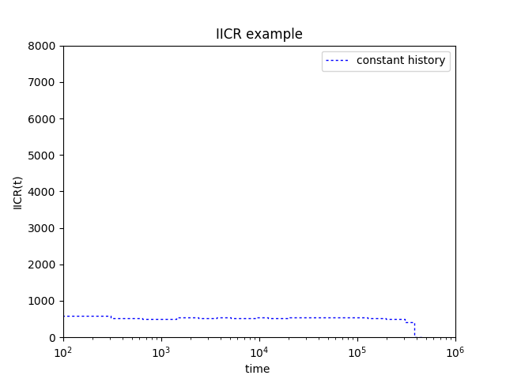
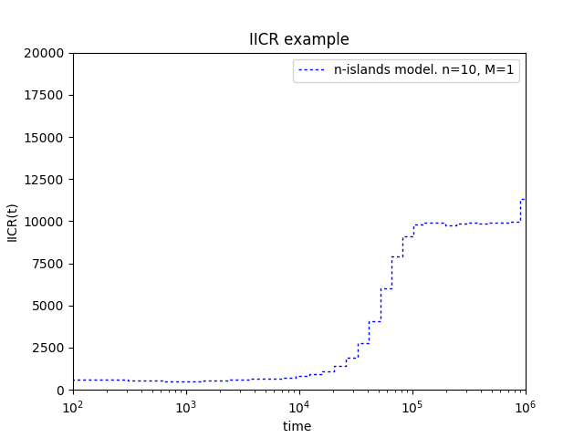
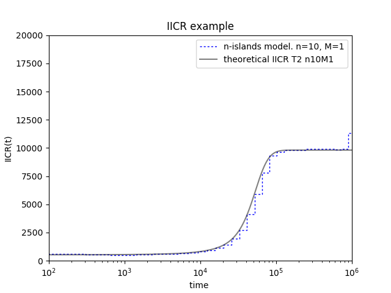

In this tutorial we will reproduce some of the IICR plots done in [Chikhi et al (2018)](https://www.nature.com/articles/s41437-017-0005-6).

<br/>

### What do you need:

1. A working version of ms

 * If you are on Windows you can download one [here](https://housecloud.willyrv.com/index.php/s/XQsrgOEc9xnvN10)

 * If you are on Linux you can download one [here](https://housecloud.willyrv.com/index.php/s/1570jtr8MosRNwW)

 * You can also download the ms code from [here](http://home.uchicago.edu/rhudson1/source/mksamples.html) and compile it by yourself

 * You have a documentation of the ms software [here](https://housecloud.willyrv.com/index.php/s/aFxTPRmdTzsk2RV)

2. A working version of python with the numpy library. A good idea is to install [Anaconda](https://www.anaconda.com/download/)

3. The python script that computes the IICR from $T_2$ values produced with ms

 * The python scripts can be downloaded [here](https://github.com/willyrv/IICREstimator).

 You can do
  ```
 git clone https://github.com/willyrv/IICREstimator
 ```
  to clone de repository or you can download the files in a .zip file


<br/>

### Testing if ms is working on your system

Put a compiled version of ms in the folder containing the python scripts. Then open a terminal in this folder an type:

1. For linux
```
./ms
```

2. For Windows:
```
ms
```

You should get an output having somthing like this in the first lines:

```
Too few command line arguments
usage: ms nsam howmany
  Options:
         -t theta   (this option and/or the next must be used. Theta = 4*N0*u )
         -s segsites   ( fixed number of segregating sites)
         -T          (Output gene tree.)
         -F minfreq     Output only sites with freq of minor allele >= minfreq.
         -r rho nsites     (rho here is 4Nc)
                 -c f track_len   (f = ratio of conversion rate to rec rate. tracklen is mean length.)
                         if rho = 0.,  f = 4*N0*g, with g the gene conversion rate.
         -G alpha  ( N(t) = N0*exp(-alpha*t) .  alpha = -log(Np/Nr)/t
```

This is actually an error message but shows that ms is working fine. We can move forward.

<br/>

### The configuration file

Scenarios for simulation are specified in a configuration textfile. The path to this file be specified when we run the script. The configuration file is in *json* format. You can see details about the *json* format [here](https://www.json.org/) or [here](https://tools.ietf.org/html/rfc7159.html). We will start using the file called *parameters_tutorial.json*. Start by open the file in a text editor. Let's look at line *4*:

```
{"ms_command":"ms 2 1000000 -T -L",
```

The command after the **:** is a ms command corresponding to a population with constant size. Let's run the script.

From the folder containing the python scripts run:
```bash
python ./estimIICR.py ./parameters_tutorial.json
```

You should get a figure like this:



We now change the ms command (which means that we will simulate data under a different scenario). Replace line *4* by:

```
{"ms_command":"ms 2 1000000 -T -L -I 10 2 0 0 0 0 0 0 0 0 0 1",
```

Which is the corresponding ms command for simulating $T_2$ values under an *n-islands* model with ten demes and gene flow equal to 1. You can also change line $5$ in order to put the corresponding label for the plot

```
"label":"n-islands model. n=10, M=1",
```

Also change the limits of the plots so that the IICR fits well inside. Modify line *41* as follows:

```
"plot_limits": [1e2, 1e6, 0, 0.8e4],
```

You should obtain a graphic like this:


It is also possible to plot the *theoretical IICR* for a given n-islands model. In order to do this, first let's have a look at lines $13$ to $21$

```
    {"n": 10,
    "M": 1,
    "sampling_same_island": 1,
    "label": "theoretical IICR T2 n10M1",
    "color": "k",
    "linestyle": "-",
    "linewidth": 1,
    "alpha": 0.5    
    }
```

It is possible to specify the values of "n" and "M" in order to plot the theoretical IICR. In this case the values are the same as in the simulated IICR. To plot the theoretical IICR go to line $39$ and change the value $0$ by $1$

```
    "plot_theor_IICR": 1,
```

Then, save the changes and run the script again.

```bash
python ./estimIICR.py ./parameters_tutorial.json
```

You should obtain this:


<br/>

### Recap

* All the parameters are specified in a text file with *json* format. The file name is *parameters_tutorial.json* and is in the same folder as the script *estimIICR.py*. Remember to **save changes** after any modification.
* You need to have a working version of ms in the same folder as the python script.
* For running the script, type:
```
python ./estimIICR.py ./parameters_tutorial.json
```
* It is possible to plot the IICR of **any** scenario that can be translated into an ms command
* How to modify the file:
  * Scenarios can be specified by ms commands in line *4*.
  * You can put a label for the scenario in line *5*.
  * The limits of the plot can be setted in line *41*.
  * You can choose to plot the theoretical IICR by changing *0* to *1* in line 56

<br/>

### Now is your turn

Go to the [supplementary file](https://static-content.springer.com/esm/art%3A10.1038%2Fs41437-017-0005-6/MediaObjects/41437_2017_5_MOESM1_ESM.pdf) of the Chikhi et al 2018 paper and use the given ms commands in order to reproduce the plots of the paper. The ms commands start in section 4 (page 10) of the pdf document.


<br/>

### Back

Back to [Day #5](./Day5_DH_genomic_data.md).   
Back to [first page](../index.md).
